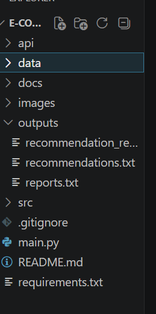
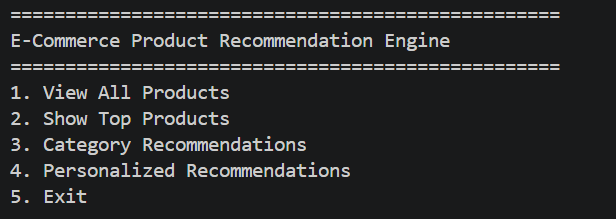
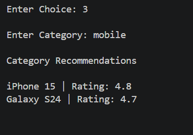
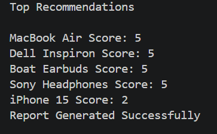

# 🛒 E-Commerce Product Recommendation Engine

## 📌 Project Overview

The **E-Commerce Product Recommendation Engine** is a DSA and Backend Development project that recommends products to users based on their search history, cart activity, purchase history, product categories, and similarity scores.

The project demonstrates how modern e-commerce platforms such as Amazon, Flipkart, and Myntra use recommendation systems to improve user engagement and product discovery.

---

## 🎯 Objectives

* Build a personalized recommendation system
* Demonstrate practical use of Data Structures & Algorithms
* Implement ranking and recommendation logic
* Create REST APIs using FastAPI
* Generate recommendation reports
* Build a GitHub portfolio project

---

## 🚀 Features

### User-Based Recommendations

* Search History Recommendations
* Cart-Based Recommendations
* Purchase-Based Recommendations

### Product-Based Recommendations

* Similar Product Suggestions
* Category-Based Recommendations
* Top Rated Products

### Backend Features

* FastAPI REST APIs
* Swagger API Documentation
* CLI Menu Interface
* Recommendation Report Generation

---

## 🏗️ Project Architecture

```text
User Activity
(Search / Cart / Purchase)
           │
           ▼
    Recommendation Engine
           │
 ┌─────────┼─────────┐
 ▼         ▼         ▼
Search    Cart    Purchase
           │
           ▼
   Similarity Scoring
           │
           ▼
    Ranking Engine
           │
           ▼
 Priority Queue (Heap)
           │
           ▼
 Top Recommendations
```

---

## 🧠 DSA Concepts Used

| Concept               | Usage                  |
| --------------------- | ---------------------- |
| HashMap (Dictionary)  | Product & User Storage |
| Lists                 | Product Collections    |
| Searching             | Product Lookup         |
| Sorting               | Product Ranking        |
| Heap (Priority Queue) | Top-N Recommendations  |
| Similarity Scoring    | Product Matching       |
| OOP                   | Product & User Classes |

---

## 📂 Folder Structure

```text
E-Commerce-Product-Recommendation-Engine/
│
├── api/
│   └── app.py
│
├── data/
│   ├── products.csv
│   ├── users.csv
│   └── interactions.csv
│
├── src/
│   ├── product.py
│   ├── user.py
│   ├── similarity.py
│   ├── recommender.py
│   ├── personalized.py
│   ├── category_recommendation.py
│   ├── top_products.py
│   ├── report_generator.py
│   └── data_loader.py
│
├── outputs/
│   └── recommendation_report.txt
│
├── images/
│
├── docs/
│
├── README.md
├── requirements.txt
└── main.py
```

---

## ⚙️ Installation

### Clone Repository

```bash
git clone https://github.com/yourusername/ecommerce-product-recommendation-engine.git
cd ecommerce-product-recommendation-engine
```

### Install Dependencies

```bash
pip install -r requirements.txt
```

---

## ▶️ Run CLI Application

```bash
python main.py
```

---

## 🌐 Run FastAPI Server

```bash
uvicorn api.app:app --reload
```

Open Swagger UI:

```text
http://127.0.0.1:8000/docs
```

---

## 🔗 API Endpoints

| Method | Endpoint             | Description                  |
| ------ | -------------------- | ---------------------------- |
| GET    | /                    | Home API                     |
| GET    | /products            | Get All Products             |
| GET    | /top-products        | Get Top Products             |
| GET    | /category/{category} | Category Recommendations     |
| GET    | /recommend           | Personalized Recommendations |

---

## 📊 Sample Output

```text
Top Recommendations

MacBook Air Score: 5
Dell Inspiron Score: 5
Sony Headphones Score: 5
Boat Earbuds Score: 5
iPhone 15 Score: 2
```

---

## 📸 Screenshots

### Folder Structure



### Main Menu



### Category Recommendation



### Personalized Recommendation



### Swagger Documentation


### Recommendation API


---

## 📈 Future Enhancements

* SQLite Database Integration
* User Authentication
* Machine Learning Recommendations
* Collaborative Filtering
* React Frontend
* Real-Time Recommendations
* Recommendation Analytics Dashboard

---

## 🎓 Learning Outcomes

* Data Structures & Algorithms
* Recommendation Systems
* FastAPI Development
* REST API Design
* Priority Queue Applications
* HashMap Optimization
* Git & GitHub Workflow

---

## 👨‍💻 Author

Bablu Kumar

B.Tech – Computer Science Engineering

---

## ⭐ If you found this project useful, consider giving it a star on GitHub!
